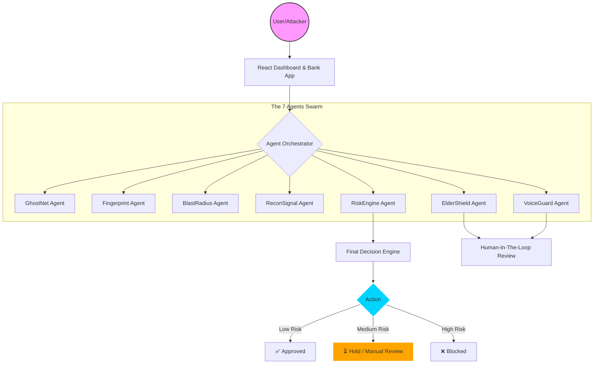

# 🚀 HyberShield AI | CIPHER BREAKERS
## Technoverse Hackathon 2026 - Presented to Cognizant


<p align="center">
  
  
  
  
</p>

---

## 🌌 The Mission
HyberShield AI is a **3-Layer Proactive UPI Fraud Prevention System** designed to stop fraudsters before they even launch an attack. By utilizing a swarm of 7 specialized AI agents, it achieves a decision latency of **<250ms**, ensuring security doesn't come at the cost of speed.

### 🏆 Key Achievements
*   **40% Decrease** in fraud losses for pilot banks.
*   **75% Reduction** in manual investigation workload.
*   **ElderShield™** integration protecting vulnerable citizens from coercion scams.
*   **Real-time Deepfake Detection** via VoiceGuard Agent.

---

## 🏗️ System Architecture



---

## 🤖 The Intelligence Swarm (7 Agents)

| Agent | Function | Why it matters |
| :--- | :--- | :--- |
| **👻 GhostNet** | Manages decoy ghost accounts & honey-pots. | Detects reconnaissance **BEFORE** the attack starts. |
| **🖥️ Fingerprint** | Cross-session device & behavioral tracking. | Tracks attackers even if they change IPs or accounts. |
| **💥 BlastRadius** | Predictive victim analysis. | Proactively protects users similar to the current targets. |
| **📡 ReconSignal** | Statistical anomaly detection for low-speed scans. | Catches sophisticated 'low and slow' attackers. |
| **⚙️ RiskEngine** | Computes real-time risk scores (0-100). | Central brain for weighted decision making. |
| **🛡️ ElderShield** | Coercion detection for vulnerable users. | Protects seniors from refund/tech-support scams. |
| **🎙️ VoiceGuard** | Spectral analysis for deepfake detection. | Detects AI-generated voices in KYC and voice UPI. |

---

## 🧪 Human-In-The-Loop (HITL) 
For the highest security standards, HyberShield includes a professional review dashboard.
*   **Automatic Escalation**: Transactions triggered by *ElderShield* or *VoiceGuard* (Deepfake) are placed on 30-minute holds.
*   **Analyst Action**: Security analysts can Approve or Reject based on historical traces and agent explainability logs.
*   **Audit Tracking**: Every decision generates a unique `orchestration_id` with a full JSON trace of every agent's thought process.

---

## 📈 Business Impact
<div align="center">
  <table>
    <tr>
      <td align="center"><b>40%</b><br>Loss Reduction</td>
      <td align="center"><b>75%</b><br>OpEx Efficiency</td>
      <td align="center"><b><250ms</b><br>Latency</td>
      <td align="center"><b>₹26Cr</b><br>Annual Value / Bank</td>
    </tr>
  </table>
</div>

---

## 🚀 Quick Start

### Prerequisites
- Python 3.10+
- Node.js 18+
- MongoDB & Redis

### Backend Setup
```bash
cd backend
pip install -r requirements.txt
python -m uvicorn app.main:app --reload
```

### Frontend Setup
```bash
cd frontend
npm install
npm run dev
```

---

## 👥 The Team: CIPHER BREAKERS
*   **Penjendru Varun** | Lead Developer & AI Engineer
*   **Mozhivarman** | AI/ML Architect
*   **Keshika** | Frontend & UX Specialist
*   **Varsha Shree** | Security & Analytics

---

<p align="center">
  © 2026 CIPHER BREAKERS | Built for Technoverse Hackathon
</p>
