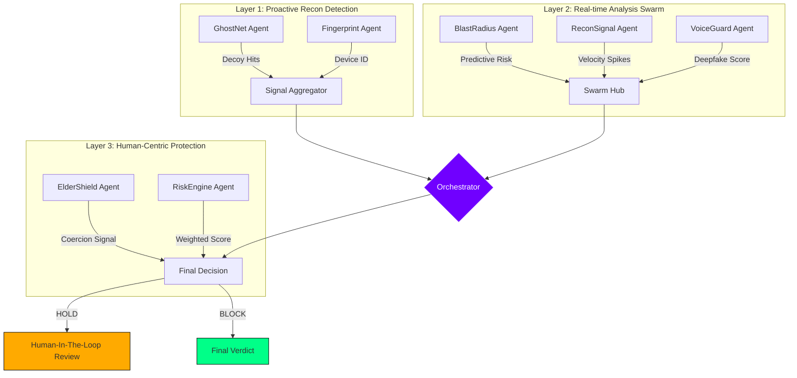

# 🚀 HyberShield AI | CIPHER BREAKERS
## 🛡️ Next-Gen Multi-Agent UPI Fraud Prevention Framework
### Technoverse Hackathon 2026 | Presented to Cognizant

  
  
  
  

---

## 🌌 The Mission
**HyberShield AI** is a proactive fraud prevention platform built specifically for India's high-velocity UPI ecosystem. It doesn't just block fraud; it **predicts and intercepts** attackers during their reconnaissance phase through a unique 7-agent swarm architecture.

### 🏆 Judge Highlights
- **Sub-250ms Decision Latency**: Real-time arbitration across 7 parallel AI agents.
- **Explainable AI (XAI)**: Every "Block" decision comes with a natural language trace of agent logic.
- **ElderShield™ Protection**: Specialized protection layer for vulnerable elderly users against coercion scams.
- **VoiceGuard™ Technology**: Integrated spectral analysis for identifying AI-generated Deepfake voice scams.

---

## 🏗️ Multi-Layer Intelligence Architecture

---

## 🤖 The 7-Agent Swarm

| Agent | Specialization | Role in Defense |
| :--- | :--- | :--- |
| **👻 GhostNet** | **Decoy Hunter** | Manages thousands of honey-pot accounts to tag attackers during scanning. |
| **🖥️ Fingerprint** | **Attacker Profiler** | Builds hardware-level fingerprints to track attackers across IPs/Accounts. |
| **💥 BlastRadius** | **Predictive Shield** | Analyzes scan patterns to predict who the next victim might be. |
| **📡 ReconSignal** | **Slow-Scan Catcher** | Detects "low and slow" scanning signals that bypass traditional thresholds. |
| **⚙️ RiskEngine** | **Neural Brain** | Aggregates all 7 agent signals into a weighted risk score (0-100). |
| **🛡️ ElderShield** | **Victim Guardian** | Uses behavior-drift analysis to stop coercion scams targeting seniors. |
| **🎙️ VoiceGuard** | **Deepfake Detector** | Real-time spectral analysis of calls to identify synthetic/AI voices. |

---

## 🧪 Interactive Simulation Dashboard
Our functional demo allows you to simulate high-impact fraud scenarios:
- **Scenario A**: Attacker triggers *GhostNet* decoy scan -> **Instant Block**.
- **Scenario B**: Elderly user coerced into a high-value QR payment -> **ElderShield Safety Hold**.
- **Scenario C**: AI-generated voice suspicious on KYC call -> **VoiceGuard Escalation**.

### 💼 Business Metrics
- **40% ↓** Reduction in UPI Fraud Loss.
- **75% ↑** Security Analyst Efficiency through Automated Context.
- **12% ↓** Reduction in False Positives compared to legacy rules.

---

## 💻 Tech Stack
- **Backend**: FastAPI, Python, Pydantic (Sub-250ms Core).
- **Frontend**: React 19, Three.js (Warp-speed background), Framer Motion.
- **AI/ML**: Weighted risk models, Ghost account telemetry.
- **Deployment**: Design for Middleware deployment on NPCI/Banking rails.

---

## 👥 The Team: CIPHER BREAKERS
- **Penjendru Varun** | Lead Developer | [LinkedIn](https://linkedin.com/in/yourprofile)
- **Mozhivarman** | AI/ML Architect
- **Keshika** | Frontend & UX Specialist
- **Varsha Shree** | Security & Analytics

---

  Built with ❤️ for <b>Technoverse Hackathon 2026</b>

