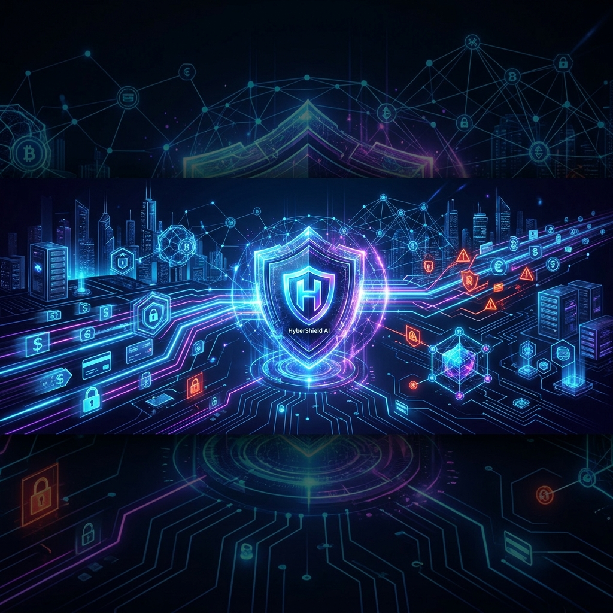
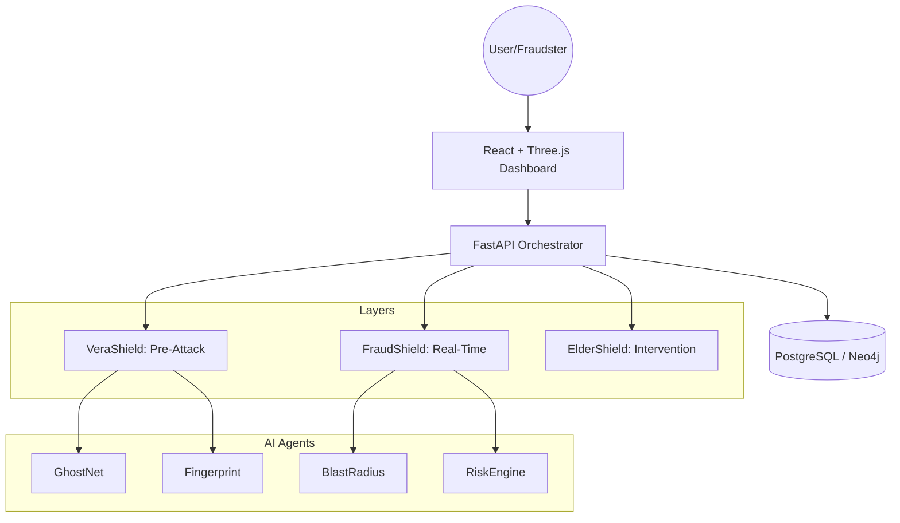

# 🚀 CIPHER BREAKERS | Technoverse Hackathon 2026

  

# 🌌 HyberShield AI
### 3-Layer Proactive UPI Fraud Prevention System

**Presented to Cognizant Technoverse Hackathon 2026**

---

## 📌 1. Problem Statement: India's UPI Crisis
UPI transaction volumes are skyrocketing, but so is fraud. Current systems suffer from high latency, high false positives, and a purely reactive approach.
- 🔴 **Lag:** 4-6 minute detection delay.
- 🔴 **False Positives:** 34% legitimate transactions blocked.
- 🔴 **Elderly Impact:** Coercion scams disproportionately target vulnerable users.

## 💡 2. Our Solution: 3-Layer Architecture
HyberShield AI introduces a proactive defense mechanism that stops fraud before it even starts.

| Layer | Component | Description |
| :--- | :--- | :--- |
| **🔍 VeraShield** | **Pre-Attack Intelligence** | Uses GhostNet to trap scanners and capture attacker fingerprints before they strike. |
| **⚡ FraudShield** | **Real-Time Scoring** | Contextual risk analysis with sub-250ms decision latency. |
| **🛡️ ElderShield** | **Human-Centric Safety** | Protected holds, family alerts, and specialized UX for elderly users. |

---

## 🤖 3. Multi-Agent Intelligence System
We use **7 specialized agents** orchestrated via LangGraph to provide comprehensive protection.

| Agent | Function | Strategic Value |
| :--- | :--- | :--- |
| 👻 **GhostNet** | Decoy Accounts | Detects reconnaissance scanning early. |
| 🖥️ **Fingerprint** | Session Tracking | Builds unique attacker IDs across IPs. |
| 💥 **BlastRadius** | Predictive Analysis | Forecasts potential target victims. |
| 📡 **ReconSignal** | Anomaly Detection | Detects "low-and-slow" scanning patterns. |
| ⚙️ **RiskEngine** | Weighted Scoring | Computes real-time risk scores (0-100). |
| 🛡️ **ElderShield** | Safety Guard | Implements coaching and intervention for vulnerable users. |
| 🎙️ **VoiceGuard** | Audio Analysis | Detects deepfake/synthetic voice artifacts in KYC. |

---

## 🏗️ 4. System Architecture

---

## 🛠️ 5. Technology Stack

---

## 🛡️ 6. Audit Tracking & Human-In-The-Loop (HITL)
To ensure accountability and prevent AI bias, HyberShield AI implements a dedicated Human-In-The-Loop workflow for high-risk transactions.
- **Audit Logs:** Every multi-agent orchestration generates a unique `orchestration_id` with sub-millisecond traces for every agent.
- **Manual Review:** Transactions flagged by ElderShield or RiskEngine (Decision: `HOLD`) are auto-queued in the Analyst Portal for approval or rejection.
- **Explainable AI (XAI):** Decisions are accompanied by a natural language reasoning generated by the orchestrator.

---

## 👥 7. Team CIPHER BREAKERS
| Role | Name |
| :--- | :--- |
| **Lead Developer** | Penjendru Varun |
| **AI/ML Architect** | Mozhivarman |
| **Frontend & UX** | Keshika |
| **Security & Analytics** | Varsha Shree |

---

## 🚀 8. Future Roadmap
- [ ] Integration with NPCI's real-time payment network.
- [ ] On-device agent deployment for extreme low-latency processing.
- [ ] Federated learning across banks to share fraud patterns without sharing PII.

---
*Developed for Cognizant Technoverse Hackathon 2026*

  
© 2026 CIPHER BREAKERS — All Rights Reserved

  Stop fraud before it reaches users.

